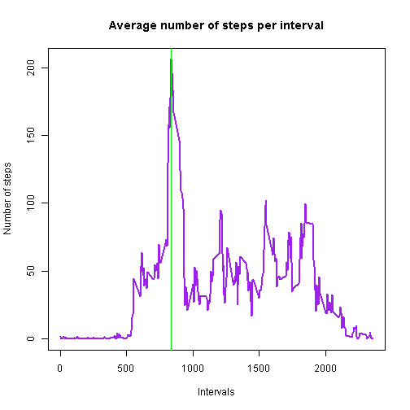

title:"Reproducible Research: Peer Assessment 1"
  html_document: PA1_template.html
    keep_md: true
    
Assignment #1 for Coursera course "Reproducible research"
=========================================================

## Loading and preprocessing the data
Firstly we neer to read our data and check names

```r
data<-read.csv("activity.csv")
names(data)
```

```
## [1] "steps"    "date"     "interval"
```
Loading packages for analysis:

```r
library(graphics)
library(plyr)
library(ggplot2)
library(rmarkdown)
```
## What is mean total number of steps taken per day?
Now we want to know average number of steps taken per day. We need to calculate this values and will save it in new data frame

```r
bydate<-aggregate(steps~date,data,sum)
```
Making a histogram

```r
hist(bydate$steps,col="blue",breaks = 10,main = "Total number of steps per day",xlab="Total number of steps")
```


Calculating median and mean of steps per day:

```r
z<-summary(bydate$steps)
z[3:4]
```

```
## Median   Mean 
##  10760  10770
```

We see that on histogram this values are the most popular.

## What is the average daily activity pattern?

Now we will make a plot of the average number of steps taken every interval.

```r
byint<-aggregate(steps~interval,data,mean)
plot(byint$interval,byint$steps,type="l",col="purple",xlab="Intervals",ylab = "Number of steps",lwd=2)
title(main = "Average number of steps per interval")
abline(v=835,col="green")
```



We want to find interval that contains the maximum average number of steps.And show it on plot(code in previous part).

```r
byint[which.max(byint$steps),]
```

```
##     interval    steps
## 104      835 206.1698
```

## Imputing missing values

Calculating the total number of missing values in the dataset:

```r
sum(is.na(data$steps))
```

```
## [1] 2304
```
Filling in all of the missing values in the dataset and saving the result to a new dataset.

```r
merdata<-merge(data,byint,by="interval",suffixes = c("",".mean"))
merdata<-merdata[order(merdata$date,merdata$interval),]
```
 Making function to fill our Missing values.

```r
replFun<-function(x,y){
   if (is.na(x)){
      return(y)
   }
   return(x)
}
merdata$steps<-mapply(replFun,merdata$steps,merdata$steps.mean)
newdata<-merdata[,1:3]
```
Now we will plot new Total number of steps per day.

```r
newbydate<-aggregate(steps~date,newdata,sum)
hist(newbydate$steps,col="blue",breaks = 10,main = "NEW Total number of steps per day",xlab="Total number of steps")
```


Calculating new values of Mean and Median:

```r
newz<-summary(newbydate$steps)
newz[3:4]
```

```
## Median   Mean 
##  10770  10770
```
So now the Median and Mean values are equal.

## Are there differences in activity patterns between weekdays and weekends?
To make a panel plot of the 5-minute interval and the average number of steps taken, averaged across all weekday days or weekend days we will create a new variable showing weekdays. I have another system language,so I need to change it:

```r
newdata$date<-as.Date(newdata$date)
Sys.setlocale("LC_TIME","English")
```

```
## [1] "English_United States.1252"
```

```r
newdata$week <- ifelse(weekdays(newdata$date) %in% c("Saturday", "Sunday"), "weekend", "weekday")
byintweek<-aggregate(steps~interval+week,newdata,mean)
g<-ggplot(byintweek,aes(interval,steps))
g+geom_line()+facet_grid(week~.)
```


